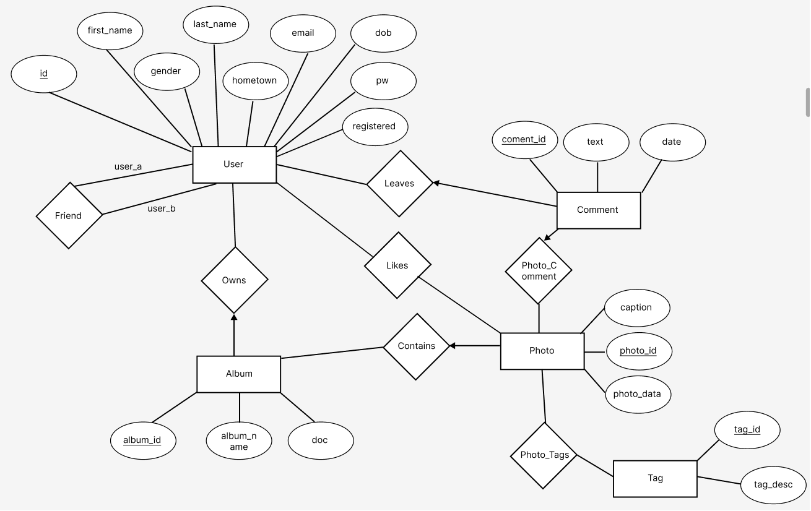

# PhotoShare Back-End Application

PhotoShare is a web-based photo-sharing application inspired by Flickr, developed as a project for our Database Systems course. The primary objective of the project was to design, implement, and document the back-end of a web application using **Django** and **PostgreSQL**. Our platform enables users to register, create albums, upload and manage photos, and engage with content through tags, likes, and comments. It includes robust user and photo management features, a recommendation system, and search functionalities.

## Features

### User Management
- **User Registration & Authentication:** Users can sign up, providing necessary details. Duplicate emails are restricted.
- **Friends List:** Users can add friends and view their friend lists, enhancing social connectivity on the platform.

### Album & Photo Management
- **Album Creation:** Registered users can create, edit, and delete albums, with each album containing photos.
- **Photo Upload & Management:** Photos can be uploaded to albums and are accessible to all users. Photos can be tagged to allow thematic browsing.
  
### Tag Management
- **Personal & Global Tag Views:** Users can categorize photos by tags, allowing both personal and global browsing by tag.
- **Popular Tags:** Displays the most popular tags, helping users discover trending content.

### Content Interaction
- **Comments:** Users and visitors can leave comments on photos, with registered users' comments contributing to an engagement score.
- **Like Functionality:** Users can like photos, and each photo shows the count of likes and the names of users who liked it.

### Advanced Search and Recommendations
- **Photo Search by Tags:** Allows both visitors and users to search photos by entering multiple tags.
- **Friends-of-Friends Recommendations:** Users receive friend recommendations based on their existing friends’ connections.
- **You-may-also-like Suggestions:** Personalized photo recommendations based on frequently used tags in the user's photo uploads.

## ER Diagram


## Tech Stack
- **Backend:** Django (Python)
- **Frontend:** HTML, JavaScript (Django templates).
- **Database Management:** PostgreSQL

## Project Highlights
- **Django ORM & PostgreSQL:** Leveraged Django’s ORM to structure and manage relational data with PostgreSQL, as well as implemented complex raw queries for user recommendations and advanced search such as:


**Tag search query:**
The user has ented a number of tags. We want to match photos that include all of them. To do this, we create a temporary table and populate it with the tags the user entered. Then, we can check if the difference between searched tags and a particular photo’s mapping tags return an empty set. If it is, then that mapping contains all the tags the user searched for.
<br>
<br>


**Friend recommendation query:**
The first view just selects the user's friends. The second view selects friends of friends but removes any of the user's friends or the user themself from that list (because we don’t want to recommend people to the user who are already his/her friends or recommend the user to the user as that doesn't make sense). And then those friends of friends are ordered by the number of mutual friends they have with respect to the user.
<br>
<br>


**Photo recommendation query:**
The inner query of the WHERE part of Auxi just selects the 5 most used tags of a user (which is passed in dynamically). Then, it selects all the photo tag mappings that match any number of those 5 tags and filters it by taking the difference of the User’s photos (we don’t want to recommend the user's photos to him/her). In the next query, the sorting happens. First, tags are ordered by how many tag hits are made out of the 5 most used user’s tag in descending order, and then it is also ordered by “conciseness”, that is, of those tags that match, those who have the least number of tags get priority.

## How to Run the Project Locally
1. **Clone the repository:**

   - `git clone https://github.com/IzahSohail/instagram2.0`

2. **Navigate to the project directory:**

   - `cd instagram2.0`

3. **Install dependencies:**
  ```bash
  pip install django
  pip install psycopg2-binary
  pip install pillow
  ```

4. **Database Initialization:**

   - Create a PostgreSQL database called `my_database`.
   - Update the database configuration in `django_Project/settings.py`:
     - On line 94, set `PASSWORD` to your PostgreSQL password.
    
5. **Run migrations and load initial data:**

   - In the project’s root directory, run the following commands:
     ```bash
     python manage.py makemigrations
     python manage.py migrate
     ```
     
6. **Start the server:**

   ```bash
   python manage.py runserver
   ```

7. **Access the application:**
   - Open your browser and go to [http://localhost:8000](http://localhost:8000) to access the web application.
